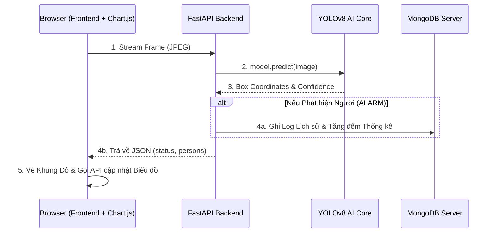

# 🎯 YOLO Guard (Enterprise Security Dashboard)


Hệ thống Camera Giám sát An ninh Nhận diện Con người (Human Detection) thời gian thực. Được thiết kế theo chuẩn **Enterprise Command Center**, hệ thống tích hợp Trí tuệ Nhân tạo YOLOv8 với Cơ sở dữ liệu MongoDB để theo dõi, ghi hình, và phân tích các vụ xâm nhập tự động.

## 🚀 Tính năng nổi bật (Features)

- **🔥 Dark Theme Command Center:** Giao diện Dashboard chuẩn doanh nghiệp, chia Tab (SPA) mượt mà không cần tải lại trang.
- **🔐 Bảo mật JWT (JSON Web Token):** Màn hình Đăng nhập phủ mờ toàn trang. Backend khóa toàn bộ API, yêu cầu có thẻ Token hợp lệ sinh ra từ tài khoản mật khẩu mã hóa (Bcrypt) trên MongoDB.
- **👁️ Nhận diện Real-time (YOLOv8):** Bắt trộm tốc độ cao trực tiếp trên luồng Camera bằng AI.
- **🚨 Lưu vết Đột nhập (MongoDB):** Mọi sự cố báo động đều được ghi thẳng vào Cơ sở dữ liệu MongoDB ngầm, dữ liệu không bao giờ bị mất khi khởi động lại.
- **📈 Phân tích Biểu đồ (Chart.js):** Tự động vẽ Biểu đồ Đường (Line Chart) mô phỏng mức độ nguy hiểm của các vụ đột nhập theo thời gian thực.
- **⚙️ Cài đặt Độ Nhạy AI:** Tính năng "Sát thủ" cho phép Admin dùng thanh trượt (Slider) lọc nhiễu AI, chỉ báo động khi độ tin cậy vượt qua ngưỡng cho phép (Ví dụ: >80%).
- **📸 Chụp ảnh Bằng chứng:** Bấm nút chụp ảnh đối tượng tình nghi cùng khung đỏ nhận diện tải thẳng về máy tính.

## 🧠 Kiến trúc Hệ thống (3-Tier Architecture)

Hệ thống hiện tại là một dây chuyền công nghiệp với 3 máy chủ chạy song song:



## 🛠️ Cài đặt & Triển khai (Deployment)

Cách chuyên nghiệp và duy nhất để chạy hệ thống này là sử dụng **Docker Compose**, vì nó cần khởi động cả 3 máy chủ (UI, API, DB) cùng lúc và nối mạng với nhau.

Yêu cầu: Máy tính/VPS đã cài đặt Docker & Docker Compose.
```bash
# Lệnh duy nhất để khởi động toàn bộ dây chuyền
docker-compose up -d --build
```

**Các cổng Dịch vụ (Ports):**
- **Trung tâm Điều khiển (Frontend):** Truy cập `http://localhost:80`
- **Lõi Trí tuệ Nhân tạo (Backend API):** Chạy ngầm tại `http://localhost:8080`
- **Cơ sở Dữ liệu (MongoDB):** Chạy ngầm tại `localhost:27017`

## 📁 Cấu trúc Thư mục Hệ thống
```text
human-detection/
├── docker-compose.yml       # Bản vẽ kiến trúc 3 Máy chủ
├── backend/
│   ├── main.py              # Logic AI YOLOv8 & Kết nối MongoDB (Motor)
│   ├── requirements.txt     # Các bộ não (FastAPI, Ultralytics, Motor)
│   └── yolov8n.pt           # Tệp tạ mô hình AI (Tự động tải)
├── frontend/
│   ├── app.js               # Logic WebRTC, SPA Tab, Chart.js & Fetch API
│   ├── index.html           # Layout Command Center (HTML5)
│   └── style.css            # Dark Theme CSS
```

## 🛡️ License
Dự án YOLO Guard được phân phối dưới giấy phép MIT. Xem thêm tại file `LICENSE`.
