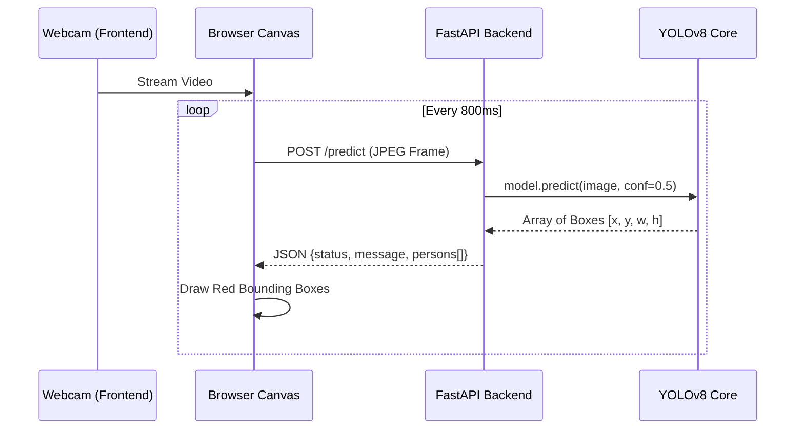

# 🎯 Human Detection (YOLOv8 Edge Vision)


Hệ thống nhận diện con người (Human Detection) thời gian thực, được thiết kế theo tiêu chuẩn công nghiệp với kiến trúc Client-Server. Hệ thống sử dụng mô hình **YOLOv8** siêu nhẹ để nhận diện và theo dõi đối tượng trên trình duyệt Web mà không cần cài đặt phần mềm nặng trên client.

## 🚀 Tính năng nổi bật (Features)
- **Real-time Object Detection:** Suy luận với tốc độ cao bằng YOLOv8n.
- **Bounding Box Overlay:** Vẽ khung nhận diện trực tiếp trên luồng Video bằng HTML5 Canvas.
- **RESTful API Architecture:** Backend độc lập bằng FastAPI, dễ dàng scale bằng Docker.
- **Zero-setup Client:** Client chỉ cần trình duyệt web hỗ trợ WebRTC (Camera).

## 🧠 Kiến trúc Hệ thống (Architecture)



## 🛠️ Cài đặt (Installation)

### 1. Yêu cầu hệ thống (Prerequisites)
- Python 3.9+
- Trình duyệt Web hiện đại (Chrome/Edge/Firefox)

### 2. Thiết lập Backend
```bash
cd backend
pip install -r requirements.txt
python main.py
```
*Server sẽ chạy tại: `http://localhost:8080`*

### 3. Khởi chạy Frontend
Chỉ cần mở file `frontend/index.html` bằng bất kỳ trình duyệt nào.
*(Yêu cầu cấp quyền truy cập Camera)*

## 📁 Cấu trúc Thư mục
```text
human-detection/
├── backend/
│   ├── main.py              # Logic AI & API Endpoint
│   ├── requirements.txt     # Thư viện Python
│   └── MODULE.md            # Tài liệu nội bộ Backend
├── frontend/
│   ├── app.js               # WebRTC & Canvas Logic
│   ├── index.html           # UI Layout
│   ├── style.css            # Dark mode UI
│   └── MODULE.md            # Tài liệu nội bộ Frontend
├── AGENT_CONTEXT.md         # Context chuẩn mực cho AI Agent
└── README.md
```

## 🛡️ License
Dự án được phân phối dưới giấy phép MIT. Xem thêm tại file `LICENSE`.
